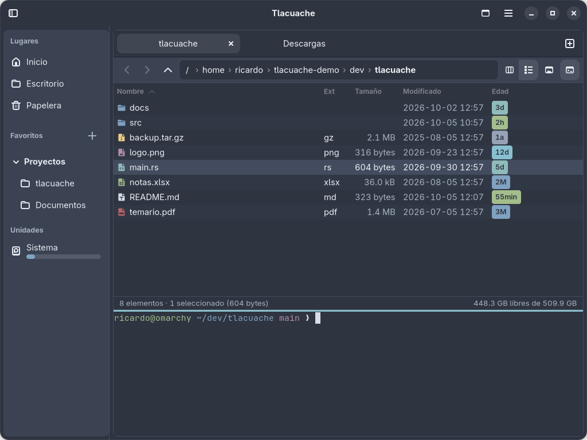
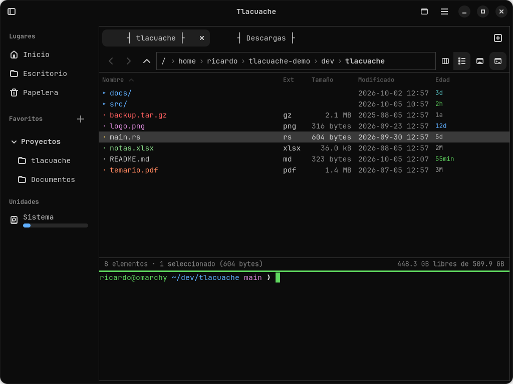
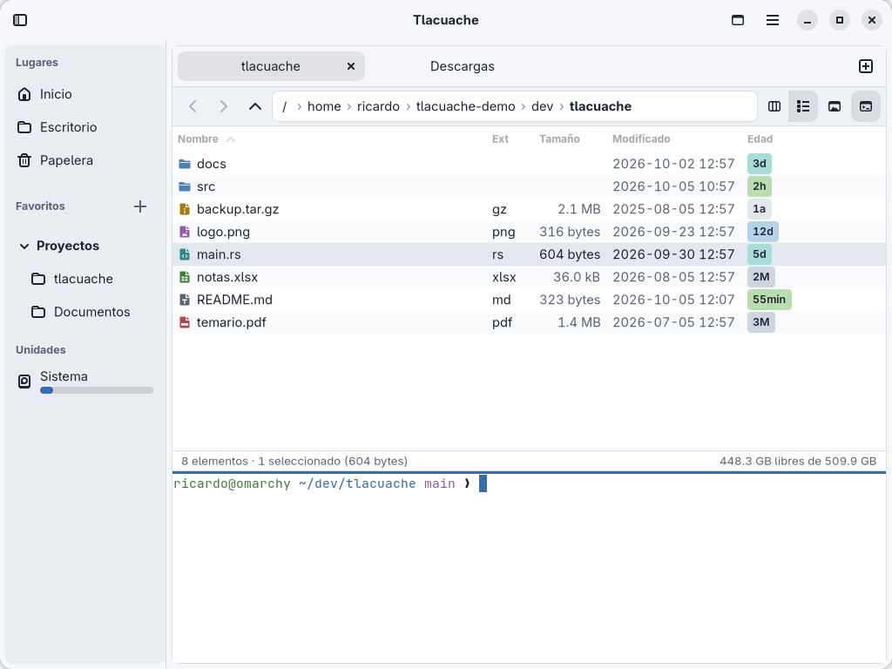
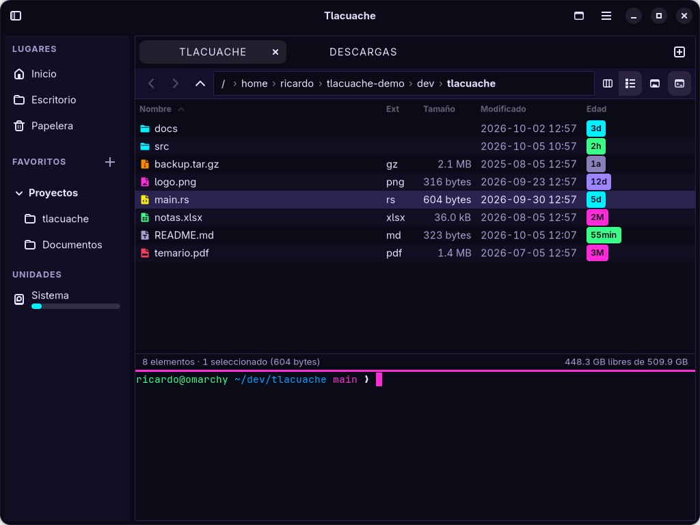
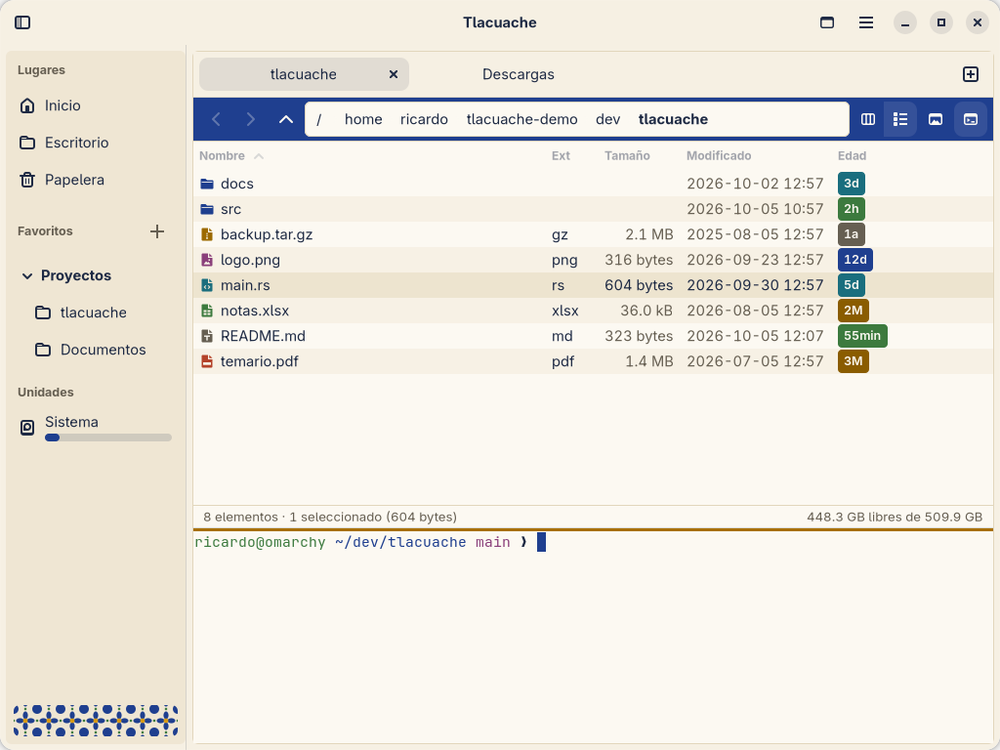

<p align="center">
  <picture>
    <source media="(prefers-color-scheme: dark)" srcset="branding/lockup-horizontal-dark.svg">
    
  </picture>
</p>

<p align="center">
  Gestor de archivos para Linux con columnas Miller, doble panel, vista previa
  y <b>una terminal real integrada en cada panel</b>, sincronizada con la carpeta actual.
  <br>Escrito en Rust con GTK4, libadwaita y VTE.
</p>

<p align="center">
  <a href="https://github.com/RicardoMonroy/Tlacuache/actions/workflows/ci.yml"></a>
</p>



## Qué hace

- **Columnas Miller**, **lista detallada** (nombre, extensión, tamaño, fecha y edad con color) y **cuadrícula de íconos**, por pestaña.
- **Uno o dos paneles** (F3) con pestañas, historial, barra de ruta editable y filtro rápido escribiendo directamente.
- **Terminal por panel** (F4): el panel sigue los `cd` de la terminal y la terminal sigue al panel; si hay un programa corriendo, avisa en vez de interrumpirlo.
- **Vista previa** (Espacio): imágenes con zoom, texto y código con resaltado, tamaño de carpetas en segundo plano y detalles del archivo; abajo o a la derecha.
- **Operaciones de archivos** en segundo plano con progreso, conflictos, deshacer (Ctrl+Z) y papelera por defecto.
- **Favoritos agrupados**, unidades con su uso de disco y arrastrar y soltar entre paneles.
- **Cinco temas** que cambian en vivo, y temas propios en TOML.

## Temas

Se eligen en Preferencias (Ctrl+,) o en el menú principal (F10), y se aplican al instante a la interfaz, la terminal y el resaltado de código.

| Nord | Consola | Claro |
|---|---|---|
|  |  |  |
| **Cyberpunk** | **Talavera** | |
|  |  | |

Para crear el tuyo, copia `crates/tlacuache-core/themes/nord.toml` a `~/.config/tlacuache/themes/mitema.toml`, cambia `id` y `name`, y ajusta los colores. Si el tema no alcanza el contraste mínimo, Tlacuache lo aplica igual y te dice qué pares fallan. Guía completa en [`docs/THEMES.md`](docs/THEMES.md).

## Compilar e instalar

Requiere GTK ≥ 4.18, libadwaita ≥ 1.7, VTE ≥ 0.80, GtkSourceView ≥ 5.16 y Rust ≥ 1.92: Arch, Debian 13, Ubuntu 26.04 LTS y Fedora 43 o posteriores. Dependencias por distribución en [`docs/SETUP_ARCH.md`](docs/SETUP_ARCH.md). En Arch:

```bash
sudo pacman -S --needed rustup base-devel pkgconf gtk4 libadwaita vte4 gtksourceview5 ttf-jetbrains-mono
rustup default stable
cargo run -p tlacuache
```

**Debian 13, Ubuntu 26.04 y Fedora 43/44:** descarga el `.deb` o el `.rpm` de la [última versión](https://github.com/RicardoMonroy/Tlacuache/releases/latest) e instálalo con tu gestor de paquetes, que resuelve las dependencias:

```bash
sudo apt install ./tlacuache-browser_*.deb     # Debian / Ubuntu
sudo dnf install ./tlacuache-browser-*.rpm     # Fedora
```

**Arch Linux**, desde AUR (con tu ayudante habitual, como `paru` o `yay`):

```bash
paru -S tlacuache-browser        # versión publicada
paru -S tlacuache-browser-git    # lo último de main
```

O con el PKGBUILD del repositorio: `cd packaging/aur/tlacuache-browser-git && makepkg -si` (ver [`packaging/aur/README.md`](packaging/aur/README.md)).

Para instalar solo para tu usuario, sin paquete, en `~/.local`:

```bash
scripts/install-local.sh
```

## Atajos principales

| Acción | Atajo |
|---|---|
| Un panel / dos paneles | F3 |
| Terminal del panel | F4 |
| Vista previa | Espacio |
| Cambiar de panel | Tab |
| Copiar / mover al otro panel | F5 / F6 |
| Renombrar | F2 |
| Ir a una ruta | Ctrl+L |
| Barra lateral | F9 |
| Preferencias | Ctrl+, |

Lista completa en [`docs/UI_SPEC.md`](docs/UI_SPEC.md).

## Configuración

`~/.config/tlacuache/config.toml` se crea con comentarios la primera vez que abres la app. Por ejemplo:

```toml
[theme]
name = "nord"            # nord | consola | claro | cyberpunk | talavera | tus temas
follow_system = false    # true: usa `light` o `dark` según el modo del sistema

[terminal]
font = ""                # vacío = la fuente monoespaciada del tema
font_size = 11

[preview]
position = "bottom"      # bottom | right
```

## Documentación

- [`docs/PRD.md`](docs/PRD.md): qué es y qué no es Tlacuache.
- [`docs/ROADMAP.md`](docs/ROADMAP.md): hitos y estado.
- [`docs/ARCHITECTURE.md`](docs/ARCHITECTURE.md) y [`docs/DECISIONS.md`](docs/DECISIONS.md): cómo está hecho y por qué.
- [`docs/BRAND.md`](docs/BRAND.md): logo, paleta e íconos.

## Contribuir

Issues, temas y pull requests son bienvenidos. Lee [`CONTRIBUTING.md`](CONTRIBUTING.md): para fusionar un PR hay que firmar una vez el [CLA](CLA.md).

## Licencia

Tlacuache Browser es software libre y gratuito bajo la [GNU General Public License v3.0 o posterior](LICENSE) (`GPL-3.0-or-later`): puedes usarlo, estudiarlo, modificarlo y compartirlo; si distribuyes una versión modificada, también debe ser libre.

## Créditos

- La paleta de marca y el tema **Nord** derivan de [Nord](https://www.nordtheme.com) de Arctic Ice Studio y Sven Greb (licencia MIT).
- Tipografía monoespaciada y wordmark: [JetBrains Mono](https://www.jetbrains.com/lp/mono/) (SIL Open Font License 1.1).
- Íconos genéricos de [Adwaita](https://gitlab.gnome.org/GNOME/adwaita-icon-theme); los íconos `tl-*` y el logo son propios del proyecto.
